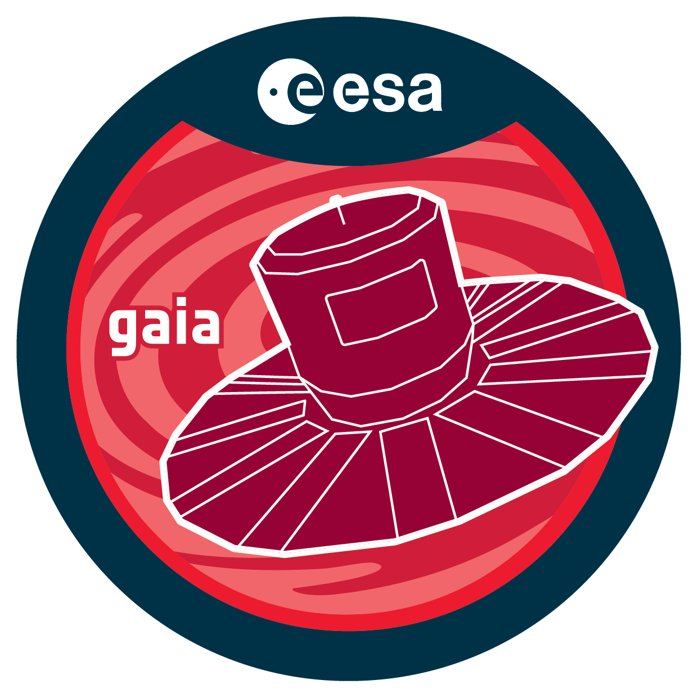

..   Copyright (c) European Space Agency, 2026.
..
..   This file is subject to the terms and conditions defined in file "LICENSE.txt", which
..   is part of this source code package. No part of the package, including
..   this file, may be copied, modified, propagated, or distributed except according to
..   the terms contained in the file "LICENSE.txt".

Installation
============

This package requires **Python >= 3.9** and the following dependencies:

- numpy
- scipy
- pandas
- astropy
- pyarrow
- astroquery

See `requirements.txt <../../../requirements.txt>`__ file for more details.

1. From source::

    $ git clone https://github.com/esa/gaia-supdate-dev/gaiasupdate
    $ cd gaiasupdate
    $ pip install -e .

2. From PyPI::

    $ pip install gaiasupdate

3. Using conda environment::

    $ conda create --name gaiasupdateEnv --yes python=3.9 -r requirements.txt
    $ conda activate gaiasupdateEnv

